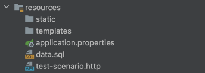
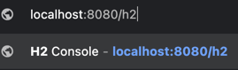
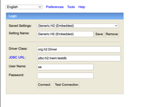
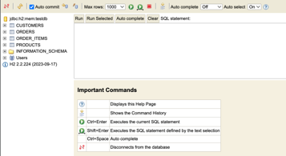

# CQRS-basic-architecture

--- 
# 프로젝트 구조 설명
이 연습용 프로젝트는 다음과 같은 CQRS 일반 모델의 특징을 보여줍니다:

커맨드 측에서는 상세한 엔티티 모델(Order, Customer, Product, OrderItem)을 사용하여 데이터를 생성하고 수정합니다.
쿼리 측에서는 DTO(OrderSummaryDto, CustomerOrdersDto)를 사용하여 필요한 정보만 조회합니다.
커맨드와 쿼리 작업이 명확히 분리되어 있습니다.
단일 데이터베이스를 사용하지만, 쿼리 측에서는 최적화된 조회 쿼리를 사용합니다.


# 프로젝트 실행 방법

1. 애플리케이션을 사용자가 실행해줍니다.
2. data.sql의 쿼리문대로 부트가 자동으로 해당 쿼리문을 실행해서 데이터를 초기화합니다.
3. 사용자가 test-scenario.http 파일에서 api 통신을 실행합니다.
</br> (실행이 안될 경우, build gradle에서 버전 호환이 안되서 그럴 수 있습니다. 자바버전, 스프링버전 , 그외 라이브러리 버전을 확인해주세요.)

# DB 콘솔창 확인 방법



---
# 프로젝트 패키지 구조 

```java
com.example.cqrs_basic
│
├── CqrsBasicApplication.java
│
│
├── application
│   ├── command
│   │   ├── dto
│   │   │   └── CreateOrderCommand.java
│   │   └── service
│   │       └── OrderCommandService.java
│   │
│   ├── query
│   │   ├── dto
│   │   │   ├── CustomerOrdersDto.java
│   │   │   └── OrderSummaryDto.java
│   │   ├── repository
│   │   │   └── OrderQueryRepository.java
│   │   └── service
│   │       └── OrderQueryService.java
│   │
│   └── common
│       └── OrderStatus.java
│
├── domain
│   ├── model
│   │   ├── Customer.java Order.java
│   │   ├── Order.java
│   │   ├── OrderItem.java
│   │   └── Product.java
│   │
│   └── repository
│       ├── CustomerRepository.java
│       ├── OrderRepository.java
│       └── ProductRepository.java
│
├── infrastructure
│   └── persistence
│       ├── mapper
│       │   ├── OrderMapper.java
│       │   ├── CustomerMapper.java
│       │   ├── ProductMapper.java
│       │   └── OrderItemMapper.java
│       │
│       └── repository
│           ├── impl
│           │   ├── command
│           │   │   ├── CustomerRepositoryImpl
│           │   │   ├── OrderRepositoryImpl
│           │   │   └── ProductRepositoryImpl
│           │   │
│           │   └── query
│           │       └── OrderQueryRepositoryImpl
│           │
│           └── jpa
│               ├── entity
│               │   ├── CustomerJpaEntity
│               │   ├── OrderItemJpaEntity
│               │   ├── OrderJpaEntity
│               │   └── ProductJpaEntity
│               │
│               ├── JpaCustomerRepository
│               ├── JpaOrderQueryRepository
│               ├── JpaOrderRepository
│               └── JpaProductRepository
│
└── presentation
    └── api
        ├── OrderCommandController.java
        └── OrderQueryController.java
```

---

# API 명세서
### 1. 주문 생성 (Create Order)
 - URL: `/api/orders`
 - Method: POST
 - Description: 새로운 주문을 생성합니다. 
 - Request Body
```java
{
  "customerId": 1,
  "items": [
    {
      "productId": 1,
      "quantity": 2
    },
    {
      "productId": 2,
      "quantity": 1
    }
  ]
}
```
 - Response
   - Status Code: 200 OK
   - Body:
```java
{
  "orderId": 1
}
```
### 2. 주문 조회 (Get Order)
 - URL: /api/orders/{orderId}
 - Method: GET
 - Description: 특정 주문의 상세 정보를 조회합니다.
 - Path Parameters 
   - orderId: 조회할 주문의 ID
- Response 
  - Status Code: 200 OK
  - Body:
```java
{
  "id": 1,
  "customerName": "John Doe",
  "totalAmount": 175.50,
  "orderDate": "2023-05-20T10:30:00",
  "status": "CREATED",
  "itemCount": 3
}
```

### 3. 고객 주문 목록 조회 (Get Customer Orders)
- URL: `/api/orders/customer/{customerId}`
- Method: GET
- Description: 특정 고객의 모든 주문 목록을 조회합니다.
- Path Parameters
    - `customerId`: 조회할 고객의 ID

- Response
    - Status Code: 200 OK
    - Body:
```java
{
        "customerName": "John Doe",
        "customerEmail": "john@example.com",
        "orders": [
        {
        "id": 1,
        "totalAmount": 175.50,
        "orderDate": "2023-05-20T10:30:00",
        "status": "CREATED",
        "itemCount": 3
        },
        {
        "id": 2,
        "totalAmount": 50.00,
        "orderDate": "2023-05-21T14:45:00",
        "status": "PAID",
        "itemCount": 1
        }
        ]
}
```
---

Q. 쿼리 구조에서 커맨드 모델에서 엔티티를 사용하는 것과 다르게  dto를 이용하는 이유를 알고 싶어요.

쿼리 구조에서 DTO(Data Transfer Object)를 명시적으로 사용하는 이유에 대해 설명드리겠습니다.


쿼리 구조에서 DTO를 사용하는 주요 이유는 다음과 같습니다:

1. 데이터 전송 최적화:
    - DTO는 클라이언트에게 필요한 데이터만을 포함합니다. 이는 네트워크 트래픽을 줄이고 성능을 향상시킵니다.
    - 예를 들어, `OrderSummaryDto`는 주문의 모든 세부 정보가 아닌 요약 정보만 포함합니다.

2. 표현 계층 분리:
    - DTO를 사용함으로써 도메인 모델과 클라이언트에게 노출되는 데이터 구조를 분리할 수 있습니다.
    - 이는 내부 도메인 모델의 변경이 API 응답 구조에 직접적인 영향을 미치지 않도록 합니다.

3. 유연성 증가:
    - 여러 엔티티의 데이터를 조합하여 클라이언트에게 필요한 형태로 제공할 수 있습니다.
    - 예를 들어, `CustomerOrdersDto`는 고객 정보와 주문 목록을 하나의 객체로 결합합니다.

4. 읽기 전용 데이터:
    - 쿼리 모델의 DTO는 일반적으로 읽기 전용입니다. 이는 CQRS의 원칙과 일치하며, 데이터 수정을 방지합니다.

5. 성능 최적화:
    - DTO를 사용하면 필요한 데이터만 정확히 조회할 수 있어, 데이터베이스 쿼리를 최적화할 수 있습니다.

6. 버전 관리 용이성:
    - API 버전 관리가 필요할 때, DTO를 사용하면 기존 도메인 모델을 변경하지 않고도 새로운 버전의 응답 구조를 만들 수 있습니다.

반면, 커맨드 모델에서는 주로 엔티티를 직접 사용합니다:

1. 데이터 무결성:
    - 커맨드 모델은 비즈니스 로직과 유효성 검사를 포함하므로, 완전한 엔티티 모델이 필요합니다.

2. 트랜잭션 처리:
    - 데이터 수정 작업은 대개 트랜잭션 내에서 이루어지며, 이는 JPA 엔티티를 통해 더 쉽게 관리됩니다.

3. 도메인 모델 일관성:
    - 커맨드 모델은 도메인 규칙을 엄격히 따라야 하므로, 도메인 엔티티를 직접 사용하는 것이 적합합니다.

결론적으로, 쿼리 모델에서 DTO를 사용하는 것은 CQRS 패턴의 '책임 분리' 원칙을 더욱 명확히 하고, 읽기 작업의 효율성과 유연성을 높이는 데 도움이 됩니다. 반면 커맨드 모델은 데이터의 정확성과 일관성을 유지하는 데 중점을 둡니다.